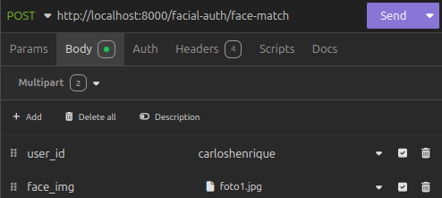
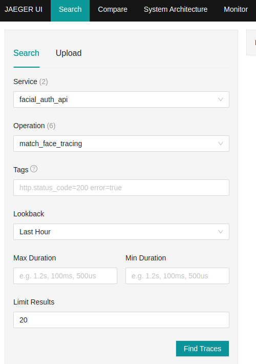
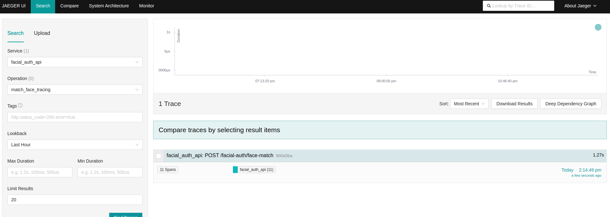
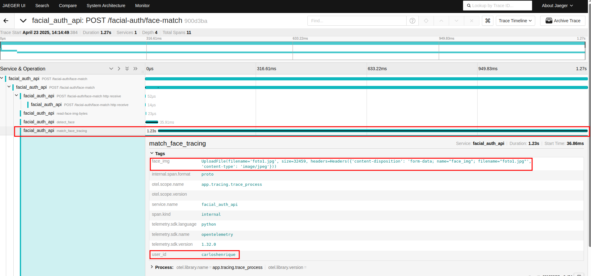

# 🚀 API de Reconhecimento Facial Conectra

Esta API desenvolvida em Python com FastAPI visa ser a ponte entre os novos apps e os serviços de autenticação facial da AWS, realizando "Face Match" e iniciando sessões de "Liveness Check".

---

## 🔧 Como executar a API

Certifique-se de ter o Docker instalado. Para iniciar a aplicação:

```bash
docker compose up
```

A aplicação estará disponível somente para as APIs internas da conectra, acessada inicialmente por:

```
http://localhost:8000
```

---

## 📌 Endpoints disponíveis

### 🟢 Face Match

**Rota:** `POST /face-match`

Verifica se a imagem informada é identificada como o usuário informado que está tentando fazer o reconhecimento.

**Parâmetros:**

| Parâmetro | Tipo | Descrição |
|-----------|------|-----------|
| `user_id` | `Form Data` (string) | Identificador único do usuário |
| `face_img` | `Form Data` (arquivo) | Imagem a ser comparada |

**Exemplo de Request no Insomnia:**




### 🟢 Start Liveness Session

**Rota:** `POST /start-liveness-session`

Inicia uma sessão de verificação de vivacidade facial.

**Parâmetros:**

| Parâmetro | Tipo | Descrição |
|-----------|------|-----------|
| `client_request_token` | `Form Data` (string) | Token único para identificar a requisição |

---

## 🔎 Tracing com Jaeger

Para garantir o monitoramento deste serviço, foi tomada a decisão de utilizar o Jaeger para o tracing, através da lib do OpenTelemetry.

Este basicamente consiste em, para cada processo/serviço realizado em uma requisição a um endpoint, será gerado um "span", basicamente um log que possui informações como tempo de execução e demais atributos que possam ser vinculados a ele.

Para que isto aconteça, as seguintes regras de implementação devem ser seguidas quando for desenvolver algo dentro da API, tomando como exemplo o endpoint "/match-face" abaixo:

```
@router.post("/face-match")
async def face_match(
    user_id: str = Form(...),
    face_img: UploadFile = File(...),
):
    default_attributes = {"face_img": str(face_img), "user_id": user_id}
    face_bytes = await trace_process('read-face-img-bytes', face_img.read, attributes=default_attributes)
    await trace_process('detect_face', detect_face, face_bytes, attributes=default_attributes)
    await trace_process('match_face', match_face, user_id, face_bytes, attributes=default_attributes)
    return JSONResponse(
        status_code=status.HTTP_201_CREATED,
        content={"message": "Face match successfuly!"}
    )
```

1. Todo processo/serviço dentro de um endpoint, que deva ser monitorado especificamente por algum motivo, deve ser encapsulado dentro de um "service" - no caso um arquivo separado só para este método - e adicionado por convenção na pasta "services".

2. O método em si não será chamado, mas sim envelopado dentro da função "trace_process", que sempre deve ser precedido de um "await". Segue abaixo a sua definição:

```
from opentelemetry import trace
from opentelemetry.trace import Status, StatusCode
import asyncio
import time

tracer = trace.get_tracer(__name__)

async def trace_process(span_name: str, func, *args, attributes=None, **kwargs):
    with tracer.start_as_current_span(span_name) as span:
        if attributes:
            for key, value in attributes.items():
                span.set_attribute(key, value)
        
        try:
            if asyncio.iscoroutinefunction(func):
                response = await func(*args, **kwargs)
            else:
                response = func(*args, **kwargs)
            return response

        except Exception as e:
            span.record_exception(e)
            span.set_status(Status(StatusCode.ERROR))
            span.add_event(f"Error occurred: {str(e)}")
            raise e

```

3. A função recebe: pan_name - nome que identifica o span na UI do Jaeger; func - recebe a função que será executada, o nosso service criado; *args - os argumentos que o service criado deve receber; attributes - deve ser informado como "attributes=", são atributos adicionais que se deseja adicionar ao span, para fins de filtro ou consulta posterior na UI do Jaeger.

4. Exemplo de utilização, temos o service "match_face" abaixo, que retorna um booleano:
```
def match_face(user_id, img_bytes):
```

5. Para utilizá-lo no "trace_process", utilizamos desta forma, dando como nome "match_face_tracing":
```
@router.post("/face-match")
async def face_match(
    user_id: str = Form(...),
    face_img: UploadFile = File(...),
):
    default_attributes = {"face_img": str(face_img), "user_id": user_id}
    meu_retorno = await trace_process('match_face_tracing', match_face, user_id, face_bytes, attributes=default_attributes)
```

6. Caso um service utilize de outro service, pode-se utilizar o mesmo trace_process sem nenhum problema. Este é apenas um envelope para que se garanta o monitoramento.

7. Ao realizar uma requisição no endpoint que utiliza deste trecho de código acima, vamos conferir na UI do Jaeger o resultado, acessando a URL abaixo

```
http://localhost:16686
```

8. Depois de realizar a requisição, atualize a página inicial do Jaeger e identifique o nosso processo, conforme imagem abaixo




9. Depois de identificar e se for o caso adicionar filtros nas tags, como respostas http igual a 201, clique em "Find Traces". Neste caso, será mostrado apenas um tracing, no caso a nossa única requisição feita. Para cada requisição é gerado um tracing.




10. Clique no tracing que se deseja consultar, e veja as informações do tracing realizado, como tempo de execução por processo definido. Note os nossos atributos customizados definidos dentro dos spans.




11. Uma vez que todas estas regras sejam seguidas, teremos monitoramento da aplicação, podendo encontrar possíveis gargalos futuros e realizar filtros de requisições em determinadas situações. Claro que sempre todo processo pode melhorar.

---

## 📚 Bibliotecas principais

- **FastAPI** para criação da API REST
- **Uvicorn** para servidor ASGI
- **OpenCV** para processamento e detecção facial
- **AWS Rekognition** para reconhecimento facial e análise de vivacidade
- **OpenTelemetry** para tracing e monitoramento distribuído

Consulte o arquivo `requirements.txt` para a lista completa de dependências.

---